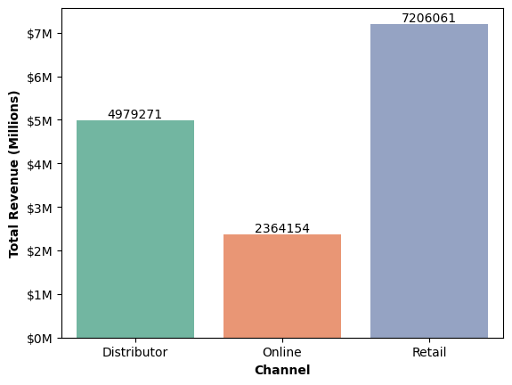

# 📊 Sales vs. Budget Analysis (2019–2021)

This project explores and visualizes multi-year sales and budget data for different customers and product groups. The goal is to uncover patterns, evaluate performance against targets, and generate insights to guide strategic decision-making.

---

## 📁 Dataset Overview

- **Years Covered**: 2017–2023  
- **Columns**:
  - `Year`
  - `Customer`
  - `Product Group`
  - `Sales (₹)`
  - `Budget (₹)`

The data tracks actual sales vs. planned budgets across various customers and product categories over a 7-year period.

---

## 🎯 Objectives

- Compare actual sales to budgeted targets.
- Identify top-performing customers and product groups.
- Visualize sales trends and variance across years.
- Generate data-driven recommendations.

---

## 🛠️ Tools & Libraries

- **Python 3**
- **pandas** – data manipulation
- **matplotlib & seaborn** – data visualization
- **Jupyter Notebook**

---

## 🔄 Data Cleaning & Transformation

- Removed rows with missing or zero values.
- Standardized column names and data types.

---

## 📈 Key Insights

- **Sales Growth**: Consistent year-over-year growth; 2023 saw the highest revenue.
- **Budget Accuracy**: Certain years exceeded targets (e.g., 2019), while others fell short (e.g., 2021).
- **Customer Trends**: A few key customers accounted for a majority of revenue and consistently outperformed.
- **Product Group Performance**: Some product groups underperformed, suggesting areas for review or repositioning.

## 📈 Revenue by Sales Channel (2017–2023)

This bar chart illustrates the **total revenue** generated across three primary sales channels—**Distributor**, **Online**, and **Retail**—over a seven-year period (2017 to 2023).

### 🔍 Key Insights:

- **🏪 Retail**:  
  - **$7.2 million** in total revenue  
  - The top-performing channel  
  - Indicates strong customer demand and distribution presence in physical stores  
  - Suggests potential for continued investment and expansion

- **🚚 Distributor**:  
  - **$5 million** in total revenue  
  - Important wholesale or B2B channel  
  - Offers scalability and volume but may benefit from optimization or incentives

- **🛒 Online**:  
  - **$2.36 million** in total revenue  
  - Underperforming compared to other channels  
  - Represents an opportunity to improve digital strategy, marketing, or platform usability

### 📌 Strategic Recommendations:

- **Capitalize on Retail**: Strengthen in-store marketing, optimize stock availability, and build on this channel’s momentum.
- **Revamp Online Strategy**: Invest in SEO, user experience, digital ads, or partnerships with e-commerce platforms to improve performance.
- **Support Distributors**: Offer training, volume discounts, or exclusive deals to drive higher throughput and loyalty.

---

> 🧠 This analysis helps the business identify top-performing channels and focus growth strategies where they can deliver the highest ROI.

---

## 🔍 Recommendations

- Reinvest in high-performing product groups and customers.
- Reassess budgeting strategy for lower-performing segments.
- Improve forecast models using historical variance patterns.

---

## 🗂️ Project Structure
