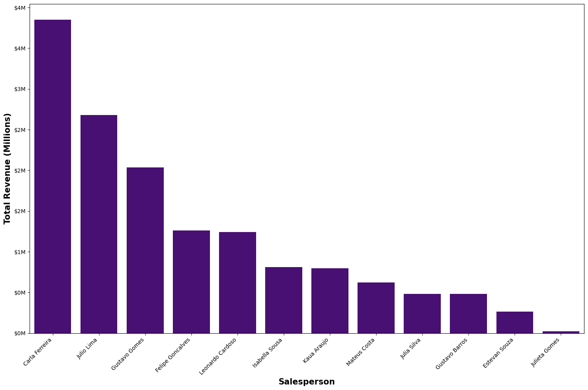
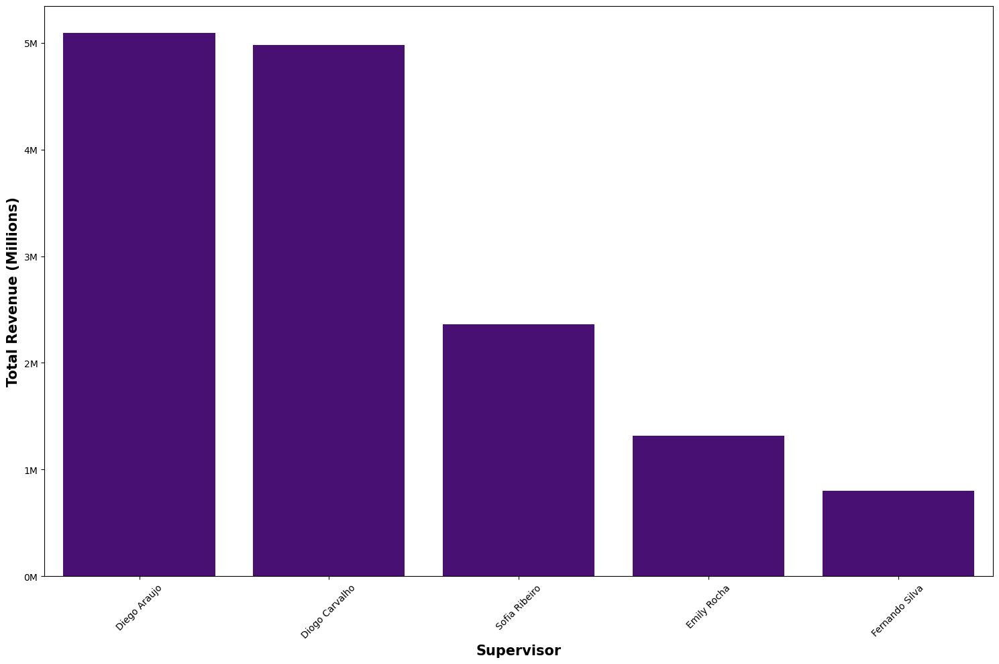
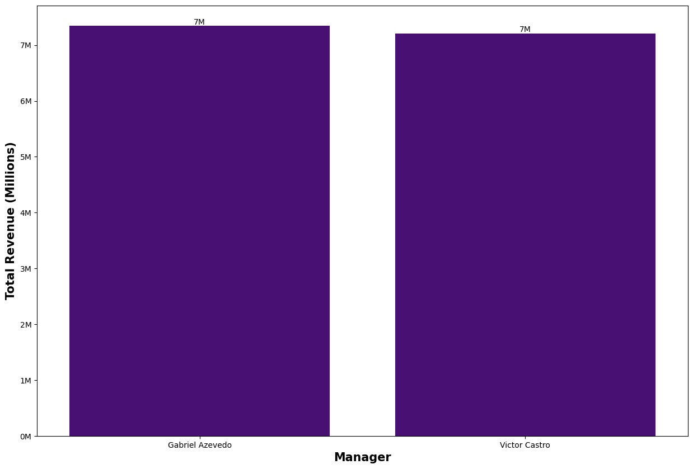
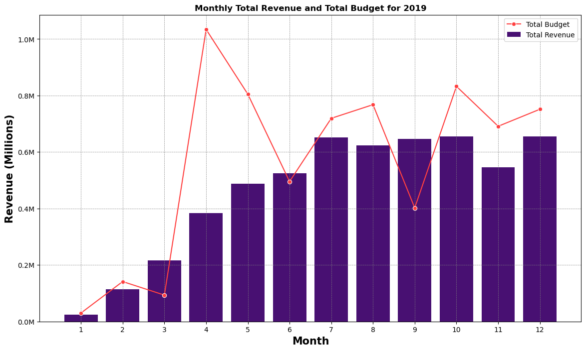
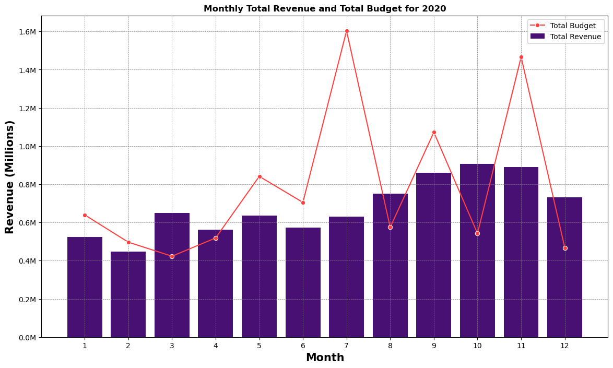
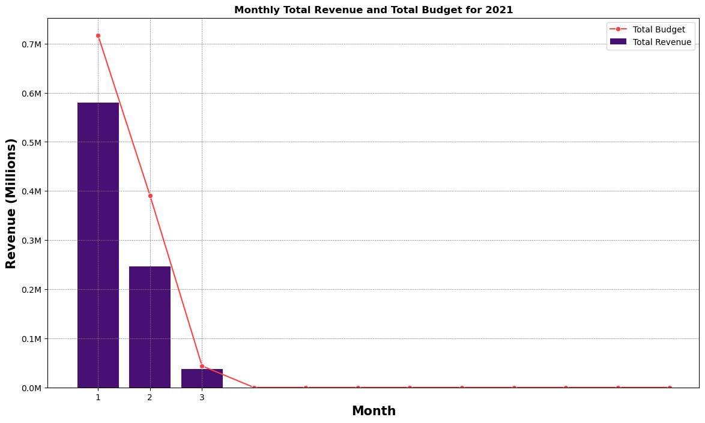
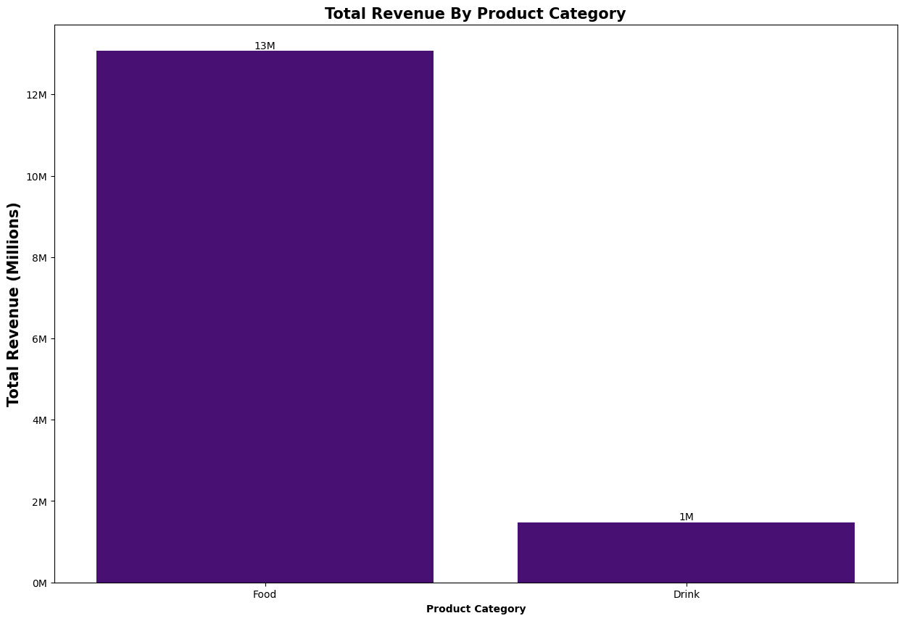
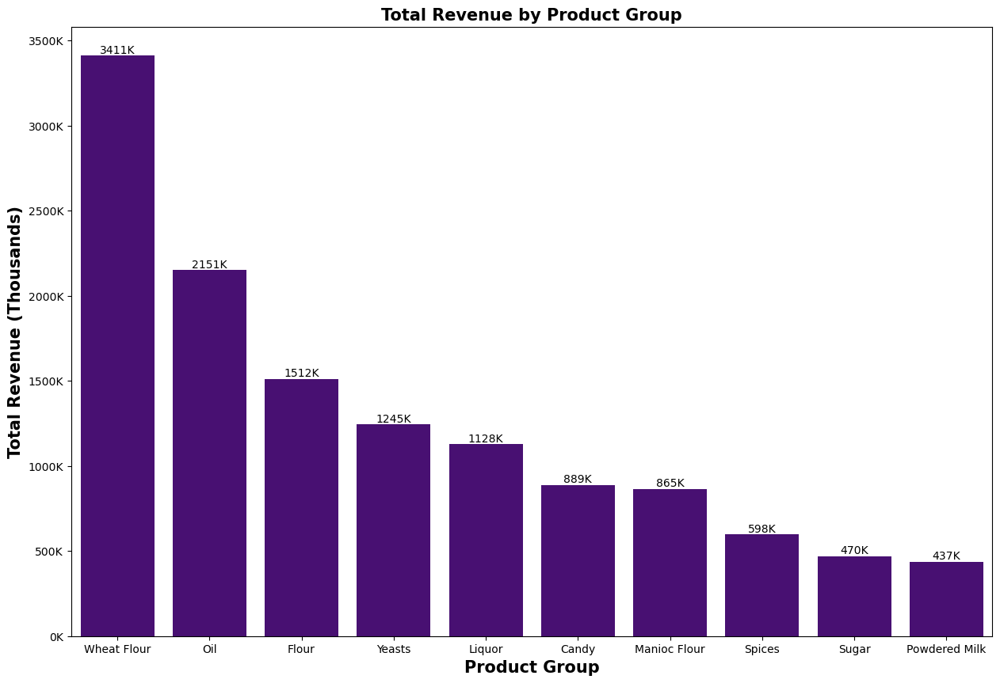

# 📊 Sales vs. Budget Analysis (2019–2021)

This project explores and visualizes multi-year sales and budget data for different customers and product groups. The goal is to uncover patterns, evaluate performance against targets, and generate insights to guide strategic decision-making.

---

## 📁 Dataset Overview

- **Years Covered**: 2017–2023  
- **Columns**:
  - `Year`
  - `Customer`
  - `Product Group`
  - `Sales (₹)`
  - `Budget (₹)`

The data tracks actual sales vs. planned budgets across various customers and product categories over a 7-year period.

---

## 🎯 Objectives

- Compare actual sales to budgeted targets.
- Identify top-performing customers and product groups.
- Visualize sales trends and variance across years.
- Generate data-driven recommendations.

---

## 🛠️ Tools & Libraries

- **Python 3**
- **pandas** – data manipulation
- **matplotlib & seaborn** – data visualization
- **Jupyter Notebook**

---

## 🔄 Data Cleaning & Transformation

- Removed rows with missing or zero values.
- Standardized column names and data types.

---

## 📈 Key Insights

- **Sales Growth**: Consistent year-over-year growth; 2023 saw the highest revenue.
- **Budget Accuracy**: Certain years exceeded targets (e.g., 2019), while others fell short (e.g., 2021).
- **Customer Trends**: A few key customers accounted for a majority of revenue and consistently outperformed.
- **Product Group Performance**: Some product groups underperformed, suggesting areas for review or repositioning.

## 📈 Revenue by Sales Channel (2017–2023)

This bar chart illustrates the **total revenue** generated across three primary sales channels—**Distributor**, **Online**, and **Retail**—over a seven-year period (2017 to 2023).

### 🔍 Key Insights:

- **🏪 Retail**:  
  - **$7.2 million** in total revenue  
  - The top-performing channel  
  - Indicates strong customer demand and distribution presence in physical stores  
  - Suggests potential for continued investment and expansion

- **🚚 Distributor**:  
  - **$5 million** in total revenue  
  - Important wholesale or B2B channel  
  - Offers scalability and volume but may benefit from optimization or incentives

- **🛒 Online**:  
  - **$2.36 million** in total revenue  
  - Underperforming compared to other channels  
  - Represents an opportunity to improve digital strategy, marketing, or platform usability

## Total Revenue by Salesperson

### Overview
This bar chart presents the total revenue generated by various salespersons. It provides a clear comparison of individual performance based on revenue contribution.

### Key Observations
- **Highest Revenue:**  
  - Carla Ferreira leads with approximately **$4 million** in revenue.
  - Julio Lima follows closely, generating slightly above **$3 million**.
- **Mid-Range Performers:**  
  - Gustavo Gomes has around **$2.5 million** in revenue.
  - Felipe Goncalves and Leonardo Cardoso both generated around **$2 million**.
- **Lower Revenue Range:**  
  - Isabella Sousa and Kaua Araujo recorded revenues slightly above **$1 million**.
  - Mateus Costa, Julia Silva, Gustavo Barros, and Estevan Souza have revenues below **$1 million**.
- **Lowest Revenue:**  
  - Julieta Gomes generated the least revenue, **close to $0 million**.

### Interpretation
- The disparity in revenues suggests potential differences in sales strategies, customer engagement, or market opportunities among salespersons.
- Top performers such as Carla Ferreira and Julio Lima may have stronger sales techniques or larger client bases.
- Salespersons in the lower revenue range might benefit from targeted strategies to improve performance.

### Conclusion
This visualization effectively highlights individual salesperson performance, making it easier to identify top achievers and areas for improvement in revenue generation.

## Total Revenue by Supervisor

### Overview
This bar chart presents the total revenue generated by various supervisors, providing a comparative analysis of their performance.

### Key Observations
- **Highest Revenue:**  
  - Diego Araujo and Diogo Carvalho lead with approximately **$5 million** in revenue.
- **Mid-Range Performers:**  
  - Sofia Ribeiro has generated slightly above **$3 million** in revenue.
  - Emily Rocha follows with revenue slightly above **$2 million**.
- **Lowest Revenue:**  
  - Fernando Silva recorded the least revenue, slightly above **$1 million**.

### Interpretation
- The top-performing supervisors (Diego Araujo and Diogo Carvalho) may have stronger managerial strategies or high-performing teams.
- Mid-range performers show consistent revenue generation but could identify areas for growth.
- Fernando Silva, being the lowest earner, may need targeted support to enhance revenue.

### Conclusion
This chart helps in understanding the revenue contributions of each supervisor, making it easier to recognize high achievers and areas that require improvement.

## Total Revenue by Manager

### Overview
This bar chart compares the total revenue generated by two managers, **Gabriel Azevedo** and **Victor Castro**. The y-axis represents **Total Revenue (Millions)**, ranging from **0M to 7M**.

### Key Observations
- **Equal Performance:**  
  - Both managers have generated a total revenue of **7 million**.
  - The bars for Gabriel Azevedo and Victor Castro are of identical height, confirming their equal revenue contribution.
- **Clear Revenue Distribution:**  
  - The visualization effectively highlights that both managers have performed at the same level in terms of revenue generation.

### Interpretation
- Since both managers have reached **7M**, this could indicate:
  - Similar **sales strategies** or **market opportunities**.
  - Consistency in **team performance** under each manager.
  - Strong revenue-generating capabilities across both leadership styles.

### Conclusion
This chart showcases **equal revenue generation** by both managers, reinforcing the balance in their total contributions. Further insights could be explored by analyzing factors such as **sales techniques, regional impacts, or client base distributions**.

## Monthly Total Revenue and Total Budget for 2019

### Overview
This chart visualizes the **monthly total revenue** and **total budget** for the year **2019**. The x-axis represents the months (**1 to 12**), while the y-axis shows revenue in **millions**. The two key metrics are displayed using:
- **Red line** (with data points) representing **Total Budget**.
- **Purple bars** representing **Total Revenue**.

### Key Observations
- **Budget Fluctuations:**  
  - Notable **peaks** in **March (Month 3), July (Month 7), and October (Month 10)**.  
  - **Dips** observed in **June (Month 6) and September (Month 9)**.
- **Revenue Trends:**  
  - **Steady growth** from **January (Month 1) to May (Month 5)**.  
  - **Stabilization** from **June (Month 6) to October (Month 10)**.  
  - **Minor variations** in the last months of the year.

### Interpretation
- The **budget** experiences significant variations, possibly due to **seasonal or operational expenses**.
- **Revenue growth** early in the year suggests a **strong initial performance** before stabilizing.
- Periods where **budget exceeds revenue** might indicate **investment or cost-heavy months**.
- Months with **matching revenue and budget** show **financial balance**.

### Conclusion
This visualization provides **insightful comparisons** between revenue and budget across 2019, helping to identify **financial trends and strategic adjustments**.

## Monthly Total Revenue and Total Budget for 2020

### Overview
This chart provides a comparative analysis of **Total Revenue** and **Total Budget** across the months of **2020**. The **x-axis** represents the months (**1 to 12**), while the **y-axis** shows revenue in **millions**. 

### Key Components
- **Red Line with Markers** → Represents **Total Budget**.
- **Purple Bars** → Represents **Total Revenue**.

### Key Observations
- **Budget Trends:**  
  - **Sharp increases** in months **8 and 10**, exceeding **1.6M**.  
  - **Budget fluctuations** throughout the year, indicating possible seasonal expenditures.  
- **Revenue Stability:**  
  - **Consistent revenue generation** across all months, remaining between **0.8M and 1.0M**.  
  - **Peak revenue** occurs around **month 8**, aligning with a budget surge.  

### Interpretation
- **Budget peaks** may indicate **increased investment periods** or **operational expansions**.
- **Revenue remains stable**, suggesting **predictable financial performance**.
- Disparities between budget and revenue in months **8 and 10** might signal **higher costs relative to earnings**.

### Conclusion
This visualization effectively highlights **budget fluctuations versus revenue stability**. Further analysis could explore **operational impacts, market trends, or seasonal influences** driving these variations.

## Monthly Total Revenue and Total Budget for 2021

### Overview
This chart presents **Total Revenue** and **Total Budget** trends for the year **2021**. The **x-axis** represents the months (**1 to 12**), and the **y-axis** shows revenue in **millions**.

### Key Components
- **Red Line with Dots** → Represents **Total Budget**.
- **Purple Bars** → Represents **Total Revenue**.

### Key Observations
- **Revenue Decline:**  
  - **January (Month 1)** recorded the highest revenue at approximately **0.7M**.  
  - Revenue **dropped sharply** in **February (0.4M) and March (0.1M)**.  
  - The remaining months show **negligible revenue generation**.
- **Budget Stability:**  
  - Despite revenue fluctuations, the **Total Budget** remains relatively stable.

### Interpretation
- The **steep decline** in revenue after the first quarter may indicate:
  - **Market shifts, strategic changes, or operational disruptions**.
  - Possible **seasonal influence** affecting sales.
  - **Budget allocation remains constant**, suggesting controlled spending despite revenue loss.

### Conclusion
This visualization highlights a **significant drop in revenue** after the first few months of **2021**, raising questions about potential external or internal influences. Further analysis could explore **causative factors and strategies for financial recovery**.

## Total Revenue by Product Category

### Overview
This bar chart displays the total revenue generated by two product categories: **Food** and **Drink**. The **y-axis** represents total revenue in **millions**, ranging from **0M to 14M**, while the **x-axis** represents the product categories.

### Key Observations
- **Dominant Category:**  
  - **Food** generates a significantly higher total revenue, reaching **13M**.  
- **Lower Revenue Category:**  
  - **Drink** contributes only **1M** in total revenue, highlighting a stark contrast.  

### Interpretation
- The large revenue gap suggests **higher consumer demand, better pricing strategies, or stronger market presence** for the Food category.
- The Drink category, with significantly lower revenue, might indicate **less market penetration, lower pricing, or reduced product variety** compared to Food.

### Conclusion
This visualization effectively demonstrates that **Food vastly outperforms Drink in total revenue**, suggesting a need to evaluate **product strategies, market trends, and promotional efforts** for the Drink category.

## Total Revenue by Product Group

### Overview
This bar chart presents the **Total Revenue (in thousands)** for various **product groups**. The x-axis represents **product groups**, while the y-axis displays **revenue figures in thousands (K)**.

### Key Observations
- **Top Revenue Generators:**  
  - **Wheat Flour** leads with the highest total revenue of **3411K**.  
  - **Oil** follows with **2151K**, significantly contributing to overall earnings.  
- **Mid-Range Performers:**  
  - **Flour (1512K), Yeasts (1245K), and Liquor (1128K)** show moderate revenue contributions.  
- **Lower Revenue Categories:**  
  - **Candy (889K), Manioc Flour (865K), and Spices (598K)** contribute smaller but noticeable revenue figures.  
- **Least Revenue Generators:**  
  - **Sugar (470K) and Powdered Milk (437K)** record the lowest total revenue.

### Interpretation
- The **dominance of Wheat Flour and Oil** suggests these products have **higher demand or better profit margins**.
- **Liquor and Yeasts**, positioned mid-range, could indicate **consistent but niche market appeal**.
- **Lower revenue for Sugar and Powdered Milk** might suggest **less consumer demand or lower pricing strategies**.

### Conclusion
This chart effectively illustrates **revenue distribution across product groups**, helping to identify **strong performers and areas requiring improvement or marketing strategies**.

### 📌 Strategic Recommendations:

- **Capitalize on Retail**: Strengthen in-store marketing, optimize stock availability, and build on this channel’s momentum.
- **Revamp Online Strategy**: Invest in SEO, user experience, digital ads, or partnerships with e-commerce platforms to improve performance.
- **Support Distributors**: Offer training, volume discounts, or exclusive deals to drive higher throughput and loyalty.

---

> 🧠 This analysis helps the business identify top-performing channels and focus growth strategies where they can deliver the highest ROI.

---

## 🔍 Recommendations

- Reinvest in high-performing product groups and customers.
- Reassess budgeting strategy for lower-performing segments.
- Improve forecast models using historical variance patterns.

---

## ✅ Conclusion

This project delivered valuable insights into the financial and operational performance of the business across multiple years and dimensions. The visual analysis highlighted top performers, revenue trends, and underperforming areas, supporting strategic planning and performance optimization.

Further enhancements such as predictive analytics and interactive dashboards can make this analysis even more actionable and insightful.

---
